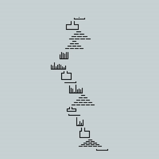

# nannou-sand-simulation

Learning [nannou](https://nannou.cc/), an open-source creative-coding toolkit for Rust, by implementing a visualization for a simulation of sand falling down in a cave (inspired by [Advent of Code year 2022 day 14](https://adventofcode.com/2022/day/14)).

## Run the code

You will need a recent version of Rust installed.

- Clone this repo
- Run with `cargo run --release`
- 🚀 Enjoy!

## References

If you want to see all my solutions for Advent of Code you can check out [my solutions repository](https://github.com/lmammino/rust-advent). I also stream these solutions on [Twitch](https://twitch.tv/loige) and the recordings are available on [YouTube](https://www.youtube.com/playlist?list=PLbNOKnE-Oyr0vFpzJL097rc8P_NfeatLD).

## Contributing

Everyone is very welcome to contribute to this project.
You can contribute just by submitting bugs or suggesting improvements by
[opening an issue on GitHub](https://github.com/lmammino/advent-of-solidjs/issues).

## License

Licensed under [MIT License](LICENSE). © Luciano Mammino.